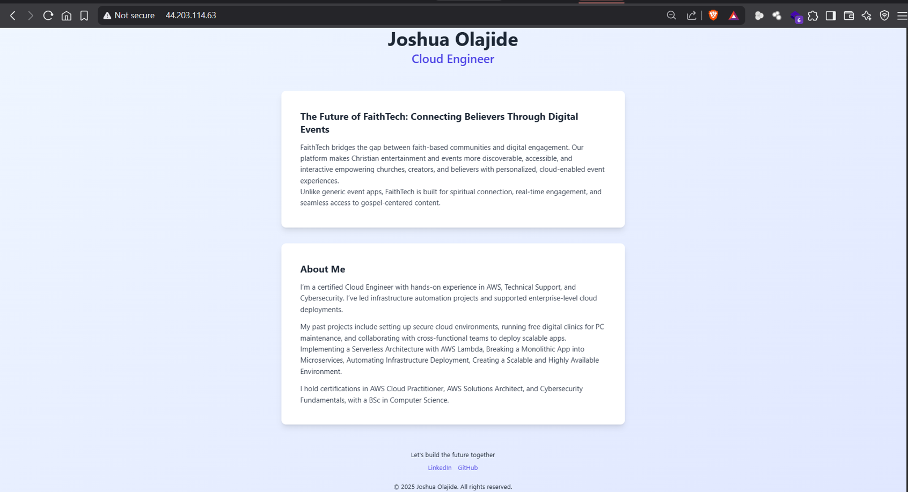

# 🚀 Dynamic Prototype Deployment – “The Future of FaithTech: Connecting Believers Through Digital Events”

This repository outlines the full process of building, configuring, and deploying a dynamic prototype landing page using modern cloud technologies.

## ✅ Objective
To provision and deploy a dynamic, production-ready landing page with interactive features hosted on a cloud server.

## 📌 Project Summary
**Title**: *The Future of FaithTech: Connecting Believers Through Digital Events*

## 🛠️ Stack
- AWS EC2 (Ubuntu 24.04)
- Nginx (Reverse Proxy)
- Tailwind CSS (Styling)

## 🌐 Live Demo
- http://44.203.114.63 
- https://digitalfaithevents.netlify.app/

## 📸 Screenshot


## 🖥️ Server Provisioning

**Cloud Provider**: AWS EC2
**OS**: Ubuntu 24.04 LTS

### Steps Taken:

1. Created an EC2 instance with Ubuntu 24.04.
2. Assigned a static Elastic IP.
3. Connected via SSH:

   ```bash
   ssh -i "your-key.pem" ubuntu@44.203.114.63
   ```

## 🌐 Web Server Setup

**Chosen Web Server**: Nginx

### Steps:

1. Installed Nginx:

   ```bash
   sudo apt update
   sudo apt install nginx
   ```

2. Restarted Nginx:

   ```bash
   sudo systemctl restart nginx
   ```

3. Checked Nginx Status:

   ```bash
   sudo systemctl status nginx
   ```

## 🧩 Dynamic Landing Page

### Frontend Details:

* Built with **HTML**, **Tailwind CSS**
* Added CSS animations for interactivity

### Files:

```
/public
  └── index.html
  └── style.css (Tailwind included)
```

## 🔐 Networking & Security

### Firewall & Port Configuration:

* Opened HTTP (80) and HTTPS (443) in AWS Security Groups
* Verified server access using:

  ```bash
  curl http://44.203.114.63
  ```
  
  ```bash
  curl https://digitalfaithevents.netlify.app
  ```

## 🌍 Domain & Access

* **Public IP**: `http://44.203.114.63`
* **Custom Domain**: `https://digitalfaithevents.netlify.app/`

## 📎 Project Structure

```
├── public/
│   ├── index.html
│   ├── style.css
└── README.md
```

## Author
**Joshua**  
Cloud Engineer 
